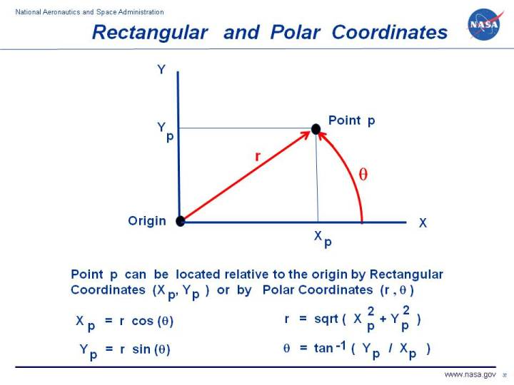
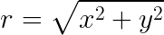
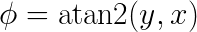
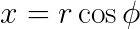
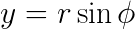

# Relation between Cartesian and Polar Coordinate systems

## Conversion from Cartesian Coordiantes to Polar Coordinates

Radial component is calculated as follows:
 

Angular component is calculated as follows:
 

## Conversion from Polar Coordiantes to Cartesian Coordinates

The _X_-coordinate is calculated as follows:
 

The _Y_-coordinate is calculated as follows:
 
